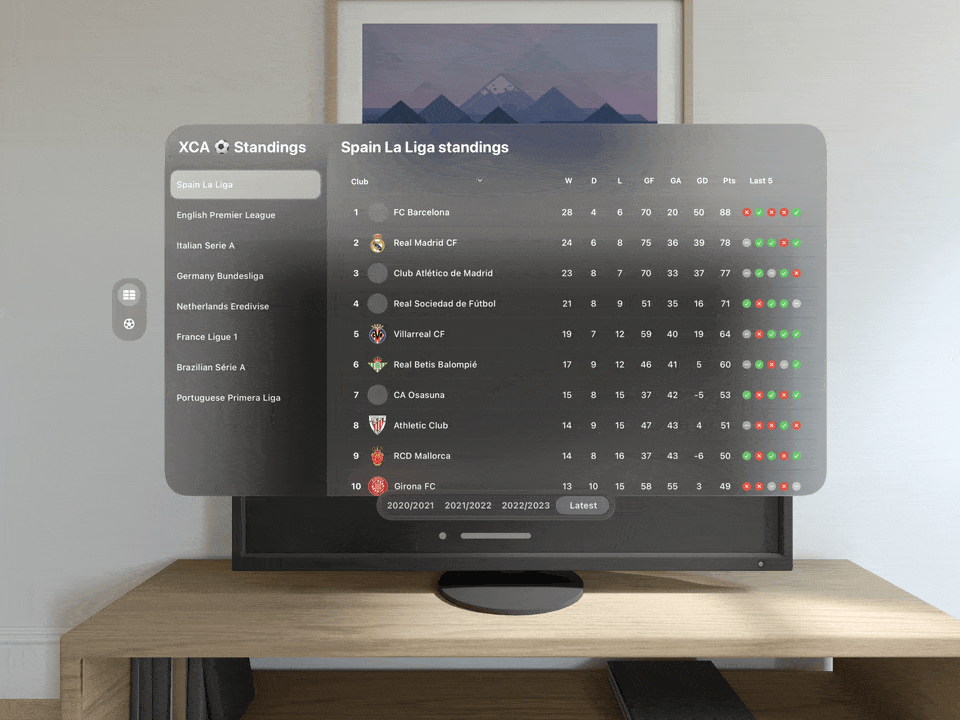

# XCAFootballStats - visionOS 👋

A project to test visionOS based on [Build a visionOS Football Stats SwiftUI App | Apple Vision Pro
]([https://www.youtube.com/watch?v=r61KA8Gzw0M])

 
  
     XCAFootballStats
      
  
  
  
   
     
    <a href="https://github.com/brsaca/XCAFootballStats/issues/new">Report bug</a>
    ·
    <a href="https://github.com/brsaca/XCAFootballStats/issues/new">Request feature</a>

## 📝 Description

## 🤖 API
- Get free api key from [Football Data](https://www.football-data.org)

## 👤 Author

**Brenda Saavedra**

- WebPage: [brendasaavedra.com](http://brendasaavedra.com)
- Github: [@brsaca](https://github.com/brsaca/)
